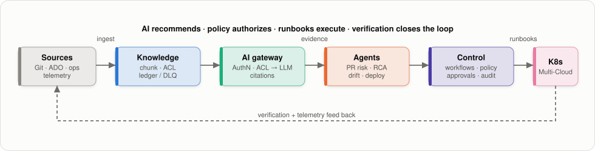

# Engineering Intelligence Platform

[](https://github.com/hatan4ik/engineering-intelligence-platform/actions/workflows/ci.yml)
[](https://github.com/hatan4ik/engineering-intelligence-platform/actions/workflows/pr-guardian.yml)
[](app/requirements.txt)
[](LICENSE)

A governed intelligence layer for the SDLC: repositories, work items, ADRs, runbooks, CI/CD
history, and operational telemetry become **evidence-backed, ACL-trimmed answers and
recommendations** — and, for certified failure classes, **supervised self-healing** on
Azure/AKS.

> **The invariant:** AI reasons and recommends → identity and ACLs constrain evidence →
> deterministic policy authorizes → allow-listed runbooks execute → independent signals
> verify → rollback/escalation closes the loop. L5 unrestricted autonomy is out of scope
> by design.

**Status:** working reference implementation plus target-state architecture — not yet a
production-ready autonomous control plane. “Implemented” means an executable, CI-covered
reference path unless an environment-scoped evidence record says otherwise; it does not mean
production-certified.

The current product wedge is **PR Guardian**: evidence-backed, initially non-blocking pull
request intelligence for one or two Azure engineering repositories. See
[`docs/PRODUCT-STRATEGY.md`](docs/PRODUCT-STRATEGY.md). The capability matrix owns the current
repository assessment; production claims require retained evidence under
[`docs/PRODUCTION-EVIDENCE.md`](docs/PRODUCTION-EVIDENCE.md).

## Contents

- [Architecture at a glance](#architecture-at-a-glance)
- [Quick start](#quick-start)
- [Azure-backed mode](#azure-backed-mode)
- [Current scope and limits](#current-scope-and-limits)
- [Documentation](#documentation)
- [Repository map](#repository-map)
- [Development](#development)
- [Transformation path](#transformation-path)

## Architecture at a glance

<p align="center">
  <picture>
    <source media="(prefers-color-scheme: dark)" srcset="docs/diagrams/readme-overview-dark.svg">
    
  </picture>
</p>

Full design with per-plane diagrams, data model, failure modes, and alternatives considered:
**[`architecture/DESIGN.md`](architecture/DESIGN.md)**.

## Quick start

```bash
python -m venv .venv && source .venv/bin/activate
pip install -r app/requirements.txt
uvicorn app.main:app --reload
```

Query the local deterministic backend (no cloud dependency):

```bash
curl -s http://127.0.0.1:8000/v1/query \
  -H 'content-type: application/json' \
  -H 'x-eip-groups: engineering' \
  -d '{"question":"How should production remediation work?"}'
```

Run the repository reference checks that CI runs:

```bash
pytest -q
python -m eval.evaluate
python -m demo.aks.scenario_runner
terraform -chdir=infra/terraform init -backend=false && terraform -chdir=infra/terraform validate
helm lint helm/eip --values helm/eip/values.ci.yaml
docker build -t eip:local .
```

These checks establish code and configuration consistency. They do not establish a production
deployment, real-data isolation, recovery behavior, or autonomous-remediation readiness.

## Azure-backed mode

Set `EIP_BACKEND=azure` plus:

| Variable | Purpose |
|---|---|
| `AZURE_SEARCH_ENDPOINT`, `AZURE_SEARCH_INDEX` | ACL-trimmed retrieval |
| `AZURE_OPENAI_ENDPOINT`, `AZURE_OPENAI_CHAT_DEPLOYMENT` | Grounded synthesis |
| `EIP_GITHUB_WEBHOOK_SECRET` | PR Guardian webhook ingress (HMAC, fail closed) |

Azure service clients use `DefaultAzureCredential` (Managed Identity in-cluster). Callers of the
gateway use an Entra access token or configured API-key principal; request headers are a
deterministic-demo affordance only and are never trusted with the Azure backend. ACL filtering is
compiled into every search request **before** any content reaches the model.

An Azure-backed request path is a reference integration until its identity, private network,
state/audit, quality, and operational evidence has been retained for a named environment. See
[`docs/PRODUCTION-EVIDENCE.md`](docs/PRODUCTION-EVIDENCE.md) and
[`architecture/NFR.md`](architecture/NFR.md).

The Helm chart deliberately refuses its default values. A deployment must provide a reviewed
values file with a digest-pinned image, Workload Identity client ID, Entra tenant/audience, and
Azure Search/OpenAI configuration; it cannot deploy the deterministic header-identity demo.
Terraform likewise requires an explicit location, environment classification, and Entra AKS admin
group. [`infra/terraform/terraform.tfvars.example`](infra/terraform/terraform.tfvars.example)
is a placeholder-only starting point, not an apply authorization.

For the durable control plane, the selected integration path is Temporal on private AKS with
private PostgreSQL. Its chart has separate fail-closed defaults and requires an existing secret;
it does not run schema migrations or create database users during a normal server release. See
[`architecture/ADR-001-temporal-control-plane.md`](architecture/ADR-001-temporal-control-plane.md).
The image also contains an mTLS-only, non-consequential Temporal evidence worker; see
[`docs/TEMPORAL-WORKER-RUNBOOK.md`](docs/TEMPORAL-WORKER-RUNBOOK.md). It is not yet the
authoritative state/audit or remediation execution path.

## Current scope and limits

| Available reference capability | Not yet a production claim |
|---|---|
| Local deterministic query demo; Azure retrieval/gateway adapters; GitHub PR Guardian workflow; policy/runbook and digital-twin reference paths | A released production container/chart, calibrated retrieval or PR-risk quality, real-data production proof, managed durable queue/audit export, or L3/L4 certification |
| PR Guardian is the first product surface; it starts as evidence-backed advisory feedback | General engineering chat, enterprise-wide source rollout, blocking controls without calibration, and production self-healing |

The exact status, owner, and remaining depth are in
[`architecture/CAPABILITY-RECONCILIATION.md`](architecture/CAPABILITY-RECONCILIATION.md). Do not
infer deployment readiness from a demo, test, or maturity score.

## Documentation

The platform's documentation is organized as a centralized **Developer Portal**, separating high-level strategic vision from deep architectural operations.

**👉 [View the Developer Portal & Master Index (docs/README.md)](docs/README.md)**

The portal is organized into:
1. **Strategic Vision & Executive Context** (The "Why")
2. **Core Architecture** (The Master Design & Security)
3. **Component Deep Dives** (Ingestion, Control Plane, RAG)
4. **Operations & Governance** (FinOps, KPIs, Certification)

## Repository map

| Path | Plane | Contents |
|---|---|---|
| `ingestion/` | Knowledge | Source events, AST/text chunking, ACLs, index adapters, ledger/DLQ/replay, embedding contract |
| `app/` | Gateway | FastAPI API, Azure RAG backend, webhook ingress, OTel bootstrap |
| `intelligence/` | Intelligence | Service graph, change risk, PR Guardian, incident/deployment/drift analysis, SLO context |
| `product/` `integrations/` `scripts/` | Intelligence | PR Guardian E2E: product service, GitHub REST/webhook adapters, CI runner |
| `control_plane/` `state/` `orchestration/` | Control | Reference workflow/state/audit contracts; Temporal mTLS evidence-worker boundary and plan-bound approvals |
| `remediation/` | Execution | Runbook catalog, deterministic policy, Kubernetes adapter, simulation, verify/rollback |
| `security/` `resilience/` | Control | Adversarial/provenance controls, degraded-mode policy, L4 certification |
| `telemetry/` `finops/` `portal/` | Observability | Operation events, cost attribution/outcomes, control-tower view models |
| `eval/` | Quality | Retrieval evaluation harness |
| `infra/` | Infra | Terraform (Azure baseline + private AI foundation), OPA policy examples |
| `helm/eip/` · `helm/temporal/` · `Dockerfile` | Deploy | Fail-closed API chart, pinned Temporal wrapper, and container image |
| `demo/aks/` | Demo | Fault/remediation scenario runner |
| `providers/` | Portability | Cloud-neutral provider contracts |
| `slides/` | Program | Board-deck generator |
| `src/` | Legacy | Early prototypes retained for reference |

## Development

```bash
pytest -q  # contracts, durability, composition, API, and policy tests
```

- CI (`.github/workflows/ci.yml`) gates reference checks: tests, evaluation harness, scenario
  runner, Terraform fmt/validate, Helm lint, an SBOM generated from the built image, and container
  smoke tests. The resulting local CI evidence is **not** a signed deployment attestation; registry
  attestation and admission enforcement are required before a production promotion.
- **PR Guardian is a shadow pilot, not a merge gate**: the pull-request workflow evaluates the
  diff with a read-only token and publishes a separate `neutral` advisory check only through a
  trusted default-branch workflow. Closed PRs can capture explicit reviewer labels for calibration.
  See [the shadow-pilot runbook](docs/PR-GUARDIAN-SHADOW-PILOT.md); no pilot evidence is collected
  or claimed by this repository alone.
- Every PR must map to a capability in the
  [reconciliation](architecture/CAPABILITY-RECONCILIATION.md) and improve a measurable
  outcome.

## Transformation path

1. **Engineering Knowledge** — secure, ACL-aware organizational memory and evidence-backed RAG
2. **AI-native SDLC** — PR Guardian, Architecture Guard, deployment intelligence
3. **Operational Intelligence** — incident correlation, drift detection, SLO-aware RCA
4. **Predictive Engineering** — explainable change/deployment risk from graph + history
5. **Supervised Self-Healing** — policy, approvals, certified runbooks, verification, rollback
6. **Bounded Autonomy** — L4 only per service/environment/runbook, after exercised evidence
