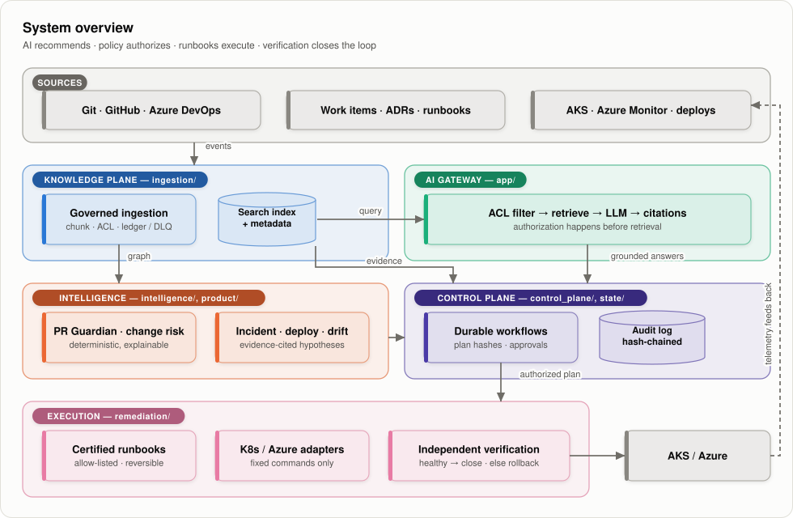
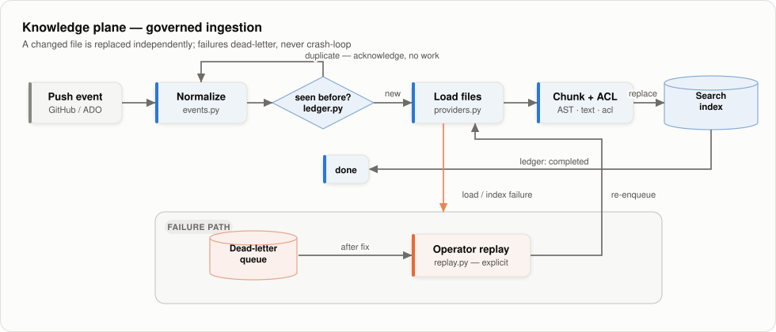
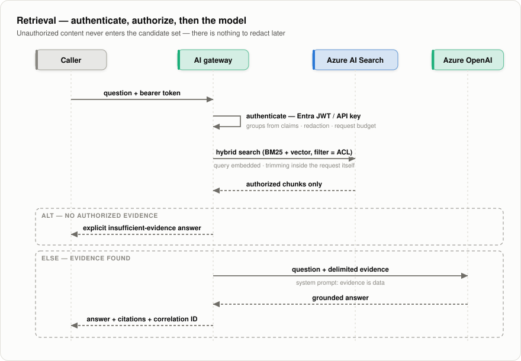
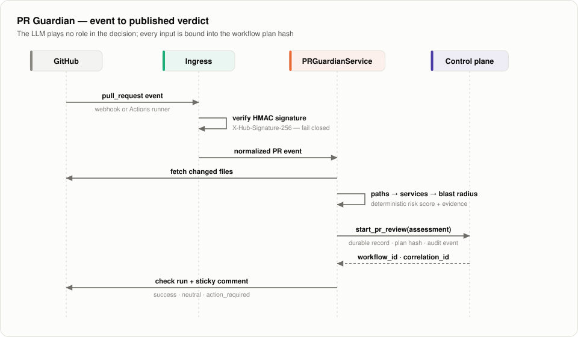
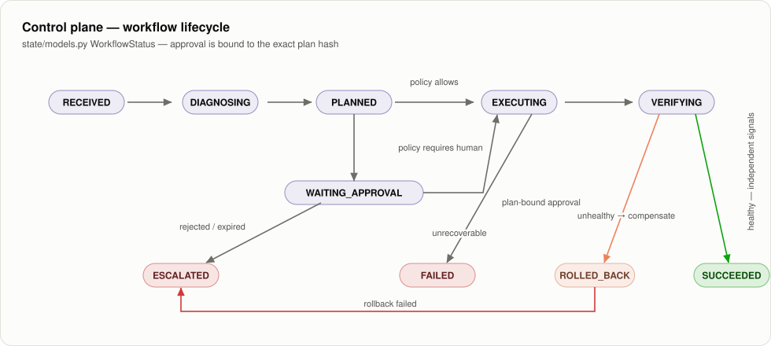
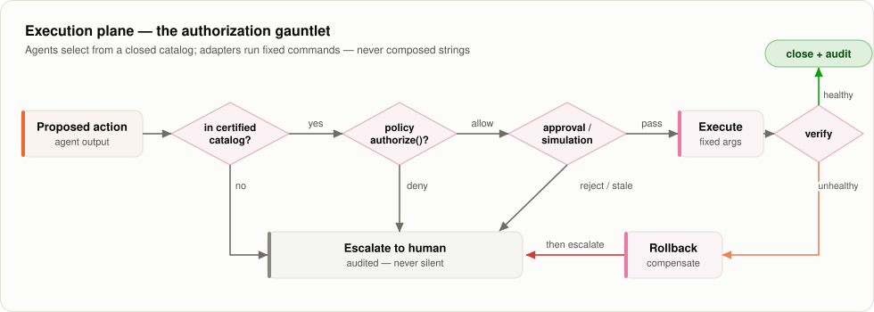
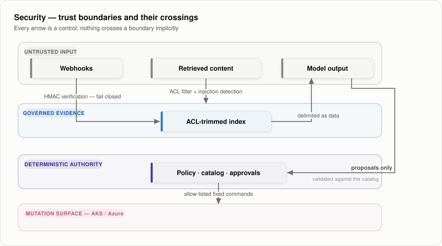

# Engineering Intelligence Platform — System Design

| | |
|---|---|
| **Classification** | Current design — mixing implemented architecture and explicitly-labeled proposed target architecture |
| **Owners** | Platform Engineering |
| **Current implementation state** | [`capability-reconciliation.md`](capability-reconciliation.md) |
| **Product decision** | [`../docs/PRODUCT-STRATEGY.md`](../docs/PRODUCT-STRATEGY.md) |
| **NFRs and production evidence** | [`non-functional-requirements.md`](non-functional-requirements.md) · [`../docs/PRODUCTION-EVIDENCE.md`](../docs/PRODUCTION-EVIDENCE.md) |
| **Threat model** | [`../governance/security-threat-model.md`](../governance/security-threat-model.md) |
| **Diagrams** | Generated light/dark SVGs — [`../docs/diagrams/build_diagrams.py`](../docs/diagrams/build_diagrams.py) |

## Contents

- [1. Context and scope](#1-context-and-scope)
- [2. Goals and non-goals](#2-goals-and-non-goals)
- [3. System overview](#3-system-overview)
- [4. Design invariants](#4-design-invariants)
- [5. Detailed design](#5-detailed-design)
  - [5.1 Knowledge plane](#51-knowledge-plane)
  - [5.2 Retrieval and AI gateway](#52-retrieval-and-ai-gateway)
  - [5.3 Intelligence plane](#53-intelligence-plane)
  - [5.4 Control plane](#54-control-plane)
  - [5.5 Execution plane](#55-execution-plane)
- [6. Security model](#6-security-model)
- [7. Data model](#7-data-model)
- [8. Failure modes](#8-failure-modes)
- [9. Observability and FinOps](#9-observability-and-finops)
- [10. Testing strategy](#10-testing-strategy)
- [11. Alternatives considered](#11-alternatives-considered)
- [12. Risks and open questions](#12-risks-and-open-questions)

---

## 1. Context and scope

Engineering organizations pay a structural scaling tax: fragmented knowledge, senior-engineer
bottlenecks, repeat incidents, and architecture drift grow faster than headcount. This platform
turns repositories, work items, ADRs, runbooks, CI/CD history, and operational telemetry into a
**governed intelligence layer embedded in the SDLC** — and, once its recommendations are proven
trustworthy, into **supervised self-healing** for certified failure classes.

This document describes the system as designed and identifies contracts implemented in the
repository. It does not make deployment or production-readiness claims. The
[capability reconciliation](capability-reconciliation.md) records repository/reference status;
the [production-evidence registry](../docs/PRODUCTION-EVIDENCE.md) records what has actually
been proven for a named environment and scope.

**In scope:** knowledge ingestion, secure retrieval, SDLC and operational intelligence agents,
the durable control plane, and bounded remediation execution on Azure/AKS.

**Out of scope:** training or hosting foundation models, unrestricted (L5) autonomy, and
replacing human accountability for high-blast-radius production changes.

## 2. Goals and non-goals

### Goals

1. **Grounded answers, never ungrounded ones** — every answer and recommendation carries
   citations to authorized evidence; empty authorized retrieval returns an explicit
   insufficient-evidence result rather than a guess.
2. **Authorization before retrieval** — identity and ACLs constrain the evidence set *before*
   any content reaches a model; security trimming is a property of the search layer, not a
   post-filter on model output.
3. **Deterministic authority** — an LLM may reason, correlate, and propose; only deterministic
   policy authorizes mutation, only allow-listed runbooks execute it, and independent signals
   verify it.
4. **Evidence-gated autonomy** — autonomy is earned per service, environment, and runbook
   through certification exercises (L0 → L4), never granted to an agent wholesale.
5. **Everything auditable** — every decision carries a correlation ID, a plan hash, and an
   append-only, hash-chained audit trail.

### Non-goals

- L5 unrestricted autonomy ("AI has cluster-admin") — explicitly unsupported.
- Building or fine-tuning foundation models — inference is routed to enterprise model APIs
  (Azure OpenAI) under tenant isolation and zero-retention terms.
- Real-time chat UX — the product surfaces are engineering workflows (PRs, incidents,
  deployments), not a general-purpose chatbot.

## 3. System overview

  <picture>
    <source media="(prefers-color-scheme: dark)" srcset="../docs/diagrams/system-overview-dark.svg">
    
  </picture>

The loop closes: execution telemetry re-enters the knowledge plane, so every incident,
deployment, and remediation becomes evidence for the next decision.

## 4. Design invariants

These hold at every layer and every autonomy level. A change that violates one is a
design regression, not a trade-off.

| # | Invariant | Enforced by |
|---|---|---|
| I1 | Authorization happens **before** retrieval | ACL filter compiled into the search query (`ingestion/azure_search.py`, `app/rag/azure_backend.py`) |
| I2 | The LLM recommends; **deterministic policy** authorizes mutation | `remediation/policy.py` `authorize()`; risk thresholds in `intelligence/pr_guardian.py` |
| I3 | Production mutation is restricted to **allow-listed, reversible runbooks** | Typed catalog in `remediation/catalog.py` |
| I4 | Every answer/action carries **evidence and an audit trail** | Plan hashes + `state/audit.py` hash chain |
| I5 | **Verification is mandatory**; failed remediation escalates, never loops | `remediation/executor.py`; control-loop `VERIFY → ESCALATE` path |
| I6 | Retrieved content is **data, never instructions** | Injection detection (`security/adversarial.py`); post-generation allow-list checks |
| I7 | **Kill switch and human override** exist at every autonomy level | Autonomy policy (`resilience/policy.py`), approval gates |
| I8 | Autonomy is **earned per service/environment/runbook** with exercised evidence | L4 certification (`resilience/exercises.py`) |

## 5. Detailed design

### 5.1 Knowledge plane

Incremental, event-driven ingestion. A changed file is replaced independently; a deletion
removes exactly that document's chunks; full reindex is reserved for schema migrations.

  <picture>
    <source media="(prefers-color-scheme: dark)" srcset="../docs/diagrams/ingestion-pipeline-dark.svg">
    
  </picture>

Key decisions:

- **Chunk identity** includes source, commit, ordinal/symbol, and a content hash; **document
  identity** excludes the commit, so a new version of a file replaces its stale chunks.
- **Idempotency is durable** (SQLite ledger locally; the same interface targets
  Cosmos DB/PostgreSQL in production). A crashed worker re-processes; a completed event is
  skipped; a poisoned event lands in the DLQ with its error, and replay is explicit.
- **Out-of-Band Reconciliation**: Event-driven ingestion inherently drops events at massive scale. A background reconciliation loop continuously cryptographically hashes the Git tree state against the index state, healing discrepancies to guarantee vector index freshness and prevent "Stale RAG" hallucinations.
- **ACLs are data**: each chunk carries `acl_groups`/`acl_users` resolved at ingestion time.
  Organizational memory (work items, docs, incidents, conversations) shares the same
  normalized model (`knowledge_normalizers.py`), so one trimming mechanism covers all sources.

### 5.2 Retrieval and AI gateway

  <picture>
    <source media="(prefers-color-scheme: dark)" srcset="../docs/diagrams/query-sequence-dark.svg">
    
  </picture>

The gateway authenticates before anything else: bearer tokens are validated as Entra ID
JWTs (`app/entra_identity.py` — issuer, audience, expiry, JWKS signature) or hashed API
keys (`app/gateway.py`), and the caller's groups come from token claims, never from
request headers. The same gateway step applies prompt redaction, selects the model tier
the principal is entitled to, and enforces a per-request cost budget.

> [!NOTE]
> **[PROPOSED TARGET STATE]** To meet FAANG-level latency and unit economic requirements in the future, the target architecture proposes adding:
> - **Materialized ACL Cache**: A Zanzibar-inspired materialized permissions cache to resolve ACLs in single-digit milliseconds before compiling them into the search query.
> - **SLM Routing & Semantic Caching**: Ephemeral **Semantic Caching** to serve repeat questions instantly, and dynamic routing to fast, local **Small Language Models (SLMs)** (e.g., Llama 3 8B) for routine tasks.

The critical property is the search call: the ACL filter is part of the request itself, so
content the caller is not entitled to **never enters the candidate set** — there is no code
path in which the model sees unauthorized text and the platform must "remember" to redact it.
Retrieval is hybrid (`ingestion/vector_search.py`): the query is embedded via the selected model provider (Azure OpenAI or local via vLLM)
and issued as a combined BM25 + vector query with semantic reranking, with the ACL filter
applied to both arms. 

> [!NOTE]
> **[PROPOSED TARGET STATE]** In strictly isolated or air-gapped environments, the target architecture proposes allowing on-prem vector databases (e.g., Qdrant, Milvus) to be swapped in for the retrieval layer.

Runtime modes: `EIP_BACKEND=deterministic` (local/CI, no cloud dependency), and 
`EIP_BACKEND=azure` (Azure AI Search + Azure OpenAI via `DefaultAzureCredential`). (Note: `EIP_BACKEND=onprem` is a proposed future state, not currently implemented).

### 5.3 Intelligence plane

Agents share three inputs — the knowledge index, the service graph, and history — and one
output contract: an evidence-carrying analysis handed to the control plane. **No agent
mutates anything.**

The service graph (`intelligence/graph.py`) is extracted from manifests and answers two
questions deterministically: *who depends on this service* (reverse-dependency traversal,
cycle-safe) and *what is the highest criticality tier in the blast radius*.

Change risk (`intelligence/risk.py`) is a deterministic, explainable score: each factor
(critical-service blast radius, diff size, IaC touch, security-boundary touch, weak test
evidence, historical regressions) contributes points and a human-readable evidence line.
The full E2E path for the flagship agent:

  <picture>
    <source media="(prefers-color-scheme: dark)" srcset="../docs/diagrams/pr-guardian-sequence-dark.svg">
    
  </picture>

Score thresholds map to controls: `≥55` extended tests, `≥70` additional approval,
`≥90` merge block. The repository runs this agent on itself
(`.github/workflows/pr-guardian.yml`).

Incident intelligence (`intelligence/incidents.py`) reconstructs an ordered evidence
timeline (alerts, Prometheus metrics, Kubelet logs, eBPF network flows, K8s events, deployments, prior incidents), correlates
deployments with failure onset, and emits **hypotheses that cite evidence IDs** —
facts and inference are structurally separated. Deployment-failure investigation and
drift detection follow the same pattern with their own evidence types. The inclusion of eBPF and low-level Kubelet logs enables deep troubleshooting for FAANG-level K8s complexities (e.g., DNS resolution timeouts, cross-node network policy drops).

### 5.4 Control plane

Every consequential decision becomes a **workflow record** with optimistic concurrency and a
**plan hash** — the SHA-256 of the exact analysis/decision it was created from.

  <picture>
    <source media="(prefers-color-scheme: dark)" srcset="../docs/diagrams/workflow-states-dark.svg">
    
  </picture>

**Approvals are plan-bound and expiring** (`orchestration/approvals.py`): an approval is an
HMAC signature over `workflow_id | approver | plan_hash | issued_at`. If the plan changes,
the hash changes and every prior approval is invalid — an operator can never approve a plan
they have not seen. Stale approvals (default 15 minutes) and clock-skewed timestamps are
rejected.

**Durable execution** (`orchestration/jobs.py`, `runner.py`): The local implementation uses a SQLite-backed job queue for CI/CD simplicity. However, the production architecture strictly mandates a **Distributed Workflow Engine (e.g., Temporal, AWS Step Functions)** to manage control-plane workflows. A custom lease-based queue is insufficient for FAANG-level reliability, as workflows must survive worker crashes natively and yield execution during long-running awaits (e.g., waiting for a node to drain) without race conditions.

**Audit** (`state/audit.py`): append-only events where each record carries the hash of its
predecessor. `verify_chain()` detects any insertion, deletion, or mutation. Every event
carries correlation ID, actor, action, resource, and payload.

### 5.5 Execution plane

  <picture>
    <source media="(prefers-color-scheme: dark)" srcset="../docs/diagrams/execution-flow-dark.svg">
    
  </picture>

- The runbook catalog is **typed and closed**: an action is a fixed command template with
  declared reversibility, blast radius, and risk tier — agents select from the catalog,
  they cannot compose arbitrary commands.
- The Kubernetes adapter executes **fixed argument vectors** (no shell, no string
  interpolation of model output).
- **Proactive Admission Control**: To prevent policy violations from reaching the cluster, deterministic policies are additionally exported as Kubernetes Admission Webhooks (via Gatekeeper or Kyverno). This acts as a hard boundary at the API server level, augmenting reactive PR guardrails.
- Verification uses signals independent of the action path where practical (SLO/error-budget
  state, not the exit code of the mutation itself).
- The legacy demo loop (`app/agents/control_loop.py`) preserves the same phase machine
  (`DETECT → DIAGNOSE → PLAN → POLICY → APPROVE → EXECUTE → VERIFY → COMPLETE/ESCALATE`)
  for the AKS scenario runner.

## 6. Security model

Trust boundaries, from least to most trusted:

  <picture>
    <source media="(prefers-color-scheme: dark)" srcset="../docs/diagrams/trust-boundaries-dark.svg">
    
  </picture>

Threat-to-control mapping (full model in
[`security-threat-model.md`](../governance/security-threat-model.md)):

| Threat | Control |
|---|---|
| Prompt injection via retrieved content | Evidence delimited as data (I6); injection scoring in `security/adversarial.py`; proposals validated against the closed catalog **after** generation |
| Cross-team data exfiltration | ACL filter compiled into every search request (I1) |
| Forged webhooks | Fail-closed HMAC `X-Hub-Signature-256` verification |
| Approval replay / confused deputy | Plan-hash-bound, expiring HMAC approvals |
| Hallucinated remediation | Closed runbook catalog; deterministic policy; mandatory independent verification |
| Automation loops repeating harm | Bounded retries, DLQ, escalation instead of retry-forever (I5) |
| Audit tampering | Hash-chained append-only log with chain verification |
| Model/token abuse | Per-operation cost telemetry (`telemetry/events.py`); budgets are tracked FinOps work |

### Autonomy ladder

| Level | May do | Gate to enter |
|---|---|---|
| L0 | Observe, summarize | Observability + audit |
| L1 | Recommend with evidence | Citation coverage + confidence |
| L2 | Create PRs / tickets / runbook proposals | Exact proposed action + rollback path |
| L3 | Execute low-risk **non-production** remediation | Policy + allow-listed runbook + verification |
| L4 | Execute allow-listed reversible **production** remediation | All L3 controls **+ per service/environment/runbook certification with exercised evidence** (`resilience/exercises.py`) |
| L5 | — | Unsupported by design |

## 7. Data model

| Record | Module | Key properties |
|---|---|---|
| `Chunk` | `ingestion/models.py` | Content-hash ID; document ID excludes commit; carries ACL, provenance, symbol, ordinal |
| `ServiceRecord` | `state/models.py` | Owner, tier, dependencies, SLO target, autonomy level; versioned |
| `WorkflowRecord` | `state/models.py` | Kind, status, correlation ID, plan hash; optimistic concurrency (`VersionConflict`) |
| `AuditEvent` | `state/models.py` | Actor, action, resource, payload, `previous_hash` → `event_hash` chain |
| `Approval` | `orchestration/approvals.py` | HMAC over workflow + approver + plan hash + timestamp |
| `Job` | `orchestration/jobs.py` | Lease, attempts/max-attempts, backoff, DLQ status |
| `OperationEvent` | `telemetry/events.py` | Correlation ID, latency, tokens, model/search/tool cost, per repo/service/agent/user |

System-of-record rule: **Azure AI Search is never the system of record** for services,
workflows, approvals, or audit — those live in the authoritative state store; the index is
a rebuildable projection.

## 8. Failure modes

| Failure | Behavior | Recovery |
|---|---|---|
| Search index unavailable during ingestion | Event fails → ledger marks failed → DLQ with error | `replay.py` after dependency recovers; idempotent by event ID |
| Search unavailable at query time | Explicit error; never silent fallback to ungrounded answers | Retry; deterministic mode for local/CI |
| Empty authorized retrieval | Explicit insufficient-evidence answer (by design, not a failure) | — |
| Worker crash holding a job lease | Lease expires → job reclaimed by next worker | Automatic; attempts counted toward DLQ bound |
| Poisoned event crash-looping | Bounded attempts → dead-letter, never infinite retry | Operator replay after fix |
| Plan changed after approval issued | Plan hash mismatch → approval invalid → `PermissionError` | Re-approve the new plan |
| Remediation verification fails | Rollback, then escalate; never re-execute in a loop | Human on-call owns escalation |
| Audit chain verification fails | Treated as integrity incident | Investigate; the chain localizes the first divergent record |
| Forged/replayed webhook | 401 before any parsing of the payload body | — |

## 9. Observability and FinOps

- **Tracing & LLMOps**: Standard OpenTelemetry spans (`app/observability.py`) capture latency and API boundaries. However, for non-deterministic AI models, the platform integrates **LLMOps tracing (e.g., LangSmith, Phoenix)**. This captures the exact prompt sent, the raw retrieved vector chunks (with relevance scores), and the generated output, enabling on-call engineers to step-by-step debug AI hallucinations.
- **Implicit Human Feedback**: Beyond latency, the platform captures user behavior as primary telemetry. If an AI leaves a PR comment and a developer ignores it, it is logged as a "False Positive". If they apply the suggested fix, it is a "True Positive". This implicit feedback is piped back into a data warehouse to continuously refine the evaluation datasets.
- **Operation telemetry**: Every agent operation emits an `OperationEvent` with token counts, model/search/tool cost, and SLA adherence—driving unit-economics (`finops/attribution.py`) and outcome ROI (`finops/outcomes.py`).
- **Audit ≠ telemetry**: Audit is the tamper-evident record of decisions; telemetry is the operational/cost signal. They share correlation IDs so any decision can be joined to its cost, latency, and full LLM trace.

## 10. Testing strategy

| Layer | Approach | Examples |
|---|---|---|
| Contracts | Pure-unit over dataclass contracts, no I/O | risk scoring, chunk identity, approval HMAC |
| Durability | Real SQLite in `tmp_path`; crash/redelivery simulated | ledger DLQ, job lease expiry, audit chain |
| Composition | Fake providers, real control plane | PR Guardian E2E, incident workflow |
| API | FastAPI `TestClient` against the real app | webhook signature, ACL headers, error paths |
| Policy | Deterministic scenario tables | autonomy gates, L4 certification evidence |
| Infra | `terraform fmt/validate`, `helm lint`, container build in CI | — |
| **AI Evals** | **Evals-as-Code** over a Golden Dataset | semantic similarity, precision/recall, and hallucination rate tracking for prompt/model changes |
| **Chaos Eng.** | **Fault Injection** via Chaos Mesh / Gremlin | randomly terminating K8s nodes in staging to measure AI's Mean Time To Remediate (MTTR) |

CI gates every PR (`ci.yml`); the PR Guardian workflow additionally reviews every PR's own diff. 
Crucially, new AI agents or prompt modifications are never deployed directly to production. They are deployed via **Shadow Launching (Dark Traffic)**: the new agent runs invisibly alongside the live agent on production events, logging its intended actions for asynchronous diffing against human behavior before being granted active execution rights.

## 11. Alternatives considered

| Decision | Chosen | Rejected | Why |
|---|---|---|---|
| Model hosting | Enterprise API (Azure OpenAI) under tenant isolation | Self-hosted open-weights on bare metal | Zero-retention enterprise terms give the IP guarantee without the GPU estate and MLOps burden; the RAG plane, not the model, is the differentiator |
| Retrieval store | Azure AI Search (hybrid BM25 + vector + semantic rerank) | pgvector | Managed security trimming, semantic ranking, and Entra integration outweigh portability; the `Index` protocol keeps pgvector possible |
| Risk authority | Deterministic, explainable scoring | LLM-judged risk | A merge gate must be reproducible, auditable, and immune to prompt injection; the LLM contributes evidence, not the verdict |
| Mutation policy | Typed in-code policy converging on OPA as the single decision service | Prose runbooks + human judgment only | Policy-as-code is testable and versioned; OPA convergence is tracked work — the current Python/OPA duplication is a known defect, not a design choice |
| Local durability | SQLite implementations of production contracts | Mocks, or cloud services required for tests | Real concurrency/durability semantics in CI; production adapters (Temporal/PostgreSQL) implement the same interfaces |
| Autonomy | Bounded L4 ceiling, per-runbook certification | L5 general autonomy | Blast radius of a wrong mutation is unbounded; evidence-gated autonomy is the product's core trust claim |

## 12. Risks and open questions

Tracked honestly; grades and queue live in the
[capability reconciliation](capability-reconciliation.md).

1. **Identity is implemented but not yet universally enforced** — Entra JWT validation and
   hashed-API-key principals exist (`app/entra_identity.py`, `app/gateway.py`); the residual
   risk is rollout: every ingress must require the gateway path, and on-behalf-of flows and
   group-to-ACL mapping against real Entra groups still need production hardening.
2. **Policy parity** — OPA is the authoritative, fail-closed decision adapter for
   remediation (`remediation/opa_policy.py`); the residual risk is drift between the local
   reference evaluator used in CI and the deployed Rego bundle — parity tests between the
   two are the control.
3. **Retrieval quality is implemented but not yet gated** — hybrid BM25 + vector retrieval
   with ACL filtering exists (`ingestion/vector_search.py`); recall/precision claims should
   still wait on the evaluation harness gating index and chunking changes in CI.
4. **Verification independence** — some verification signals still derive from the action
   path; SLO-based independent verification is required before L4 certification is credible.
5. **Local contracts vs production adapters** — SQLite semantics are proven and the Cosmos
   Temporal adapter is the authoritative execution engine; the legacy Azure Service Bus
   adapter is still unwritten, and semantic drift between local and production adapters
   (isolation, lease clocks, compare-and-swap behavior) remains the risk to test for.
